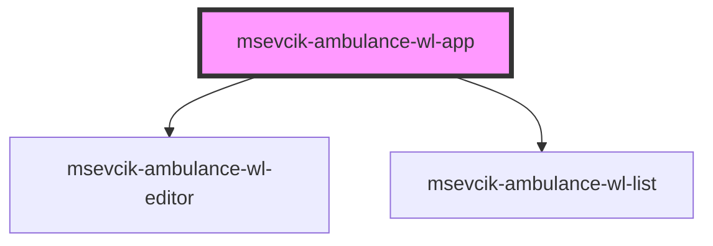

# msevcik-ambulance-wl-app

<!-- Auto Generated Below -->

## Properties

| Property    | Attribute   | Description | Type     | Default |
| ----------- | ----------- | ----------- | -------- | ------- |
| `ambulance` | `ambulance` |             | `string` | `""`    |
| `apiUri`    | `api-uri`   |             | `string` | `""`    |
| `basePath`  | `base-path` |             | `string` | `""`    |

## Dependencies

### Depends on

- [msevcik-ambulance-wl-editor](../msevcik-ambulance-wl-editor)
- [msevcik-ambulance-wl-list](../msevcik-ambulance-wl-list)

### Graph

----------------------------------------------

*Built with [StencilJS](https://stenciljs.com/)*
