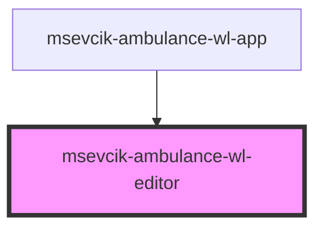

# msevcik-ambulance-wl-editor

<!-- Auto Generated Below -->

## Properties

| Property    | Attribute   | Description | Type     | Default     |
| ----------- | ----------- | ----------- | -------- | ----------- |
| `ambulance` | `ambulance` |             | `string` | `""`        |
| `apiUri`    | `api-uri`   |             | `string` | `null`      |
| `entryId`   | `entry-id`  |             | `string` | `undefined` |

## Events

| Event      | Description | Type                            |
| ---------- | ----------- | ------------------------------- |
| `canceled` |             | `CustomEvent<WaitingListEntry>` |
| `deleted`  |             | `CustomEvent<WaitingListEntry>` |
| `wlChange` |             | `CustomEvent<WaitingListEntry>` |

## Dependencies

### Used by

 - [msevcik-ambulance-wl-app](../msevcik-ambulance-wl-app)

### Graph

----------------------------------------------

*Built with [StencilJS](https://stenciljs.com/)*
