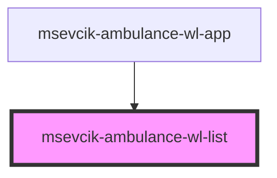

# msevcik-ambulance-wl-list

<!-- Auto Generated Below -->

## Properties

| Property          | Attribute           | Description | Type     | Default     |
| ----------------- | ------------------- | ----------- | -------- | ----------- |
| `ambulance`       | `ambulance`         |             | `string` | `""`        |
| `apiUri`          | `api-uri`           |             | `string` | `null`      |
| `selectedEntryId` | `selected-entry-id` |             | `string` | `undefined` |

## Events

| Event             | Description | Type                  |
| ----------------- | ----------- | --------------------- |
| `wlEntrySelected` |             | `CustomEvent<string>` |

## Dependencies

### Used by

 - [msevcik-ambulance-wl-app](../msevcik-ambulance-wl-app)

### Graph

----------------------------------------------

*Built with [StencilJS](https://stenciljs.com/)*
